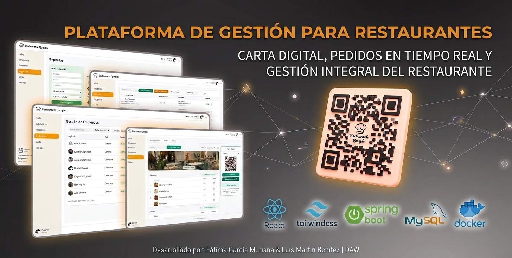
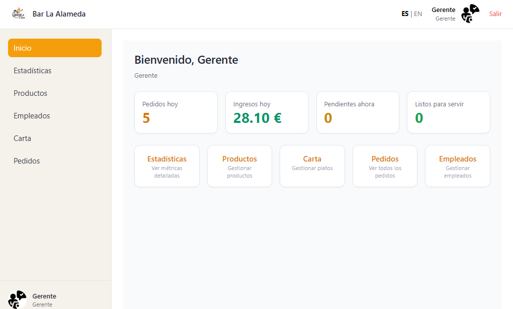
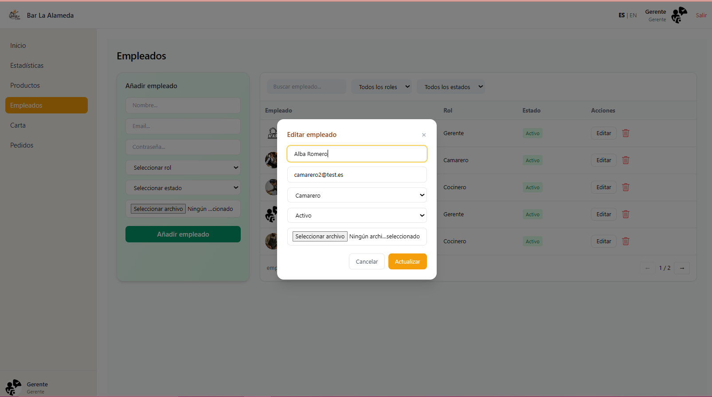
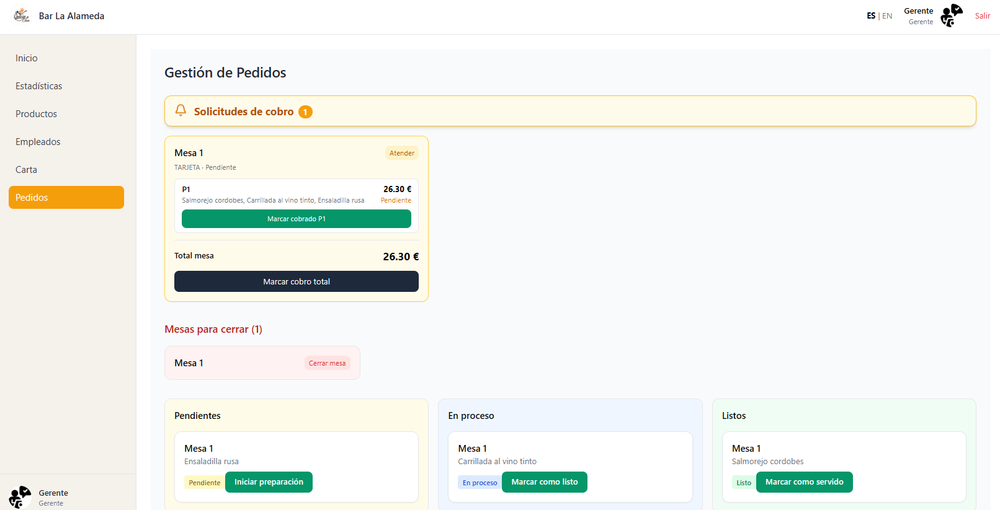
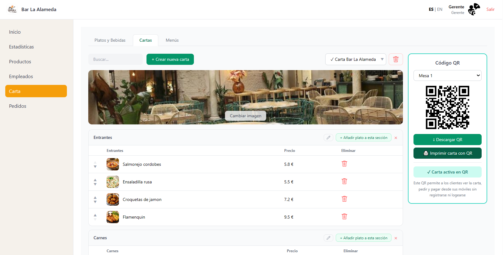
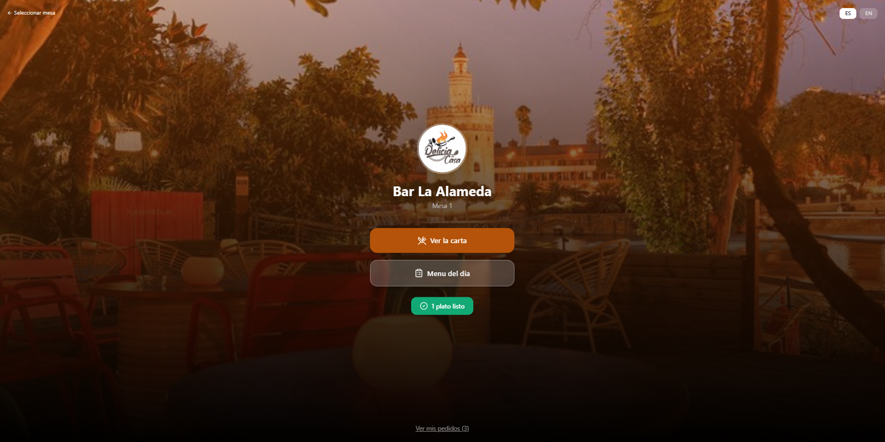
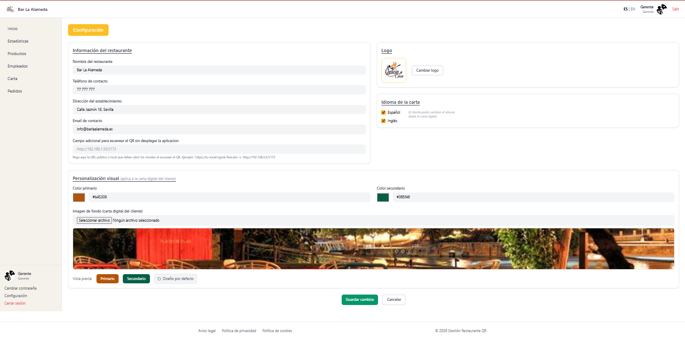

  

# Plataforma de Gestión para Restaurantes

Aplicación web desarrollada para digitalizar la gestión operativa de restaurantes mediante códigos QR, pedidos en tiempo real y administración centralizada.

---

## Descripción

Este proyecto fue desarrollado con el objetivo de centralizar la gestión diaria de un restaurante dentro de una única plataforma, permitiendo conectar clientes, camareros, cocina y gerencia mediante un sistema accesible desde cualquier dispositivo.

La aplicación permite a los clientes acceder a la carta digital escaneando un código QR desde su mesa, consultar los productos disponibles, realizar pedidos y solicitar la cuenta directamente desde su dispositivo móvil.

Por otro lado, el personal del restaurante dispone de diferentes áreas de trabajo adaptadas a cada rol, facilitando la coordinación entre sala y cocina y permitiendo gestionar pedidos, cobros, empleados, productos, proveedores y configuración general del establecimiento.

Uno de los aspectos más destacados del proyecto es la gestión de cobros, permitiendo tanto el pago completo de una mesa como la división de cuentas entre varios comensales o la realización de cobros individualizados.

---

## Roles del sistema

### Cliente

- Acceso a la carta digital mediante código QR.
- Consulta de productos organizados por categorías.
- Visualización del menú del día.
- Realización de pedidos desde el móvil.
- Seguimiento del estado de los pedidos.
- Solicitud de cuenta desde la mesa.
- Experiencia adaptada a dispositivos móviles.

### Camarero

- Gestión de mesas activas.
- Recepción y seguimiento de pedidos.
- Gestión de solicitudes de cobro.
- Control del servicio de sala.
- Coordinación con cocina.
- Apertura y cierre de mesas.

### Cocina

- Recepción de pedidos en tiempo real.
- Seguimiento de pedidos pendientes.
- Actualización de estados de preparación.
- Gestión del flujo de trabajo de cocina.
- Sin acceso a funciones de cobro o gestión de mesas.

### Gerencia

- Gestión de empleados y roles.
- Gestión de productos.
- Gestión de proveedores.
- Administración de cartas digitales.
- Configuración del restaurante.
- Consulta de estadísticas e indicadores.
- Personalización de la experiencia mostrada al cliente.

---

## Funcionalidades principales

### Carta digital mediante QR

Los clientes pueden acceder a la carta escaneando un código QR asociado a su mesa, consultar platos y bebidas disponibles, visualizar imágenes y realizar pedidos sin necesidad de instalar ninguna aplicación.

### Gestión de pedidos en tiempo real

Los pedidos realizados desde las mesas se reflejan automáticamente en el sistema, permitiendo el seguimiento completo de cada pedido desde su solicitud hasta su entrega.

### Gestión de cobros

La plataforma permite solicitar la cuenta desde la mesa, realizar cobros completos y dividir una cuenta entre varios comensales, facilitando la gestión de grupos y pagos compartidos.

### Administración centralizada

La aplicación incorpora herramientas para gestionar empleados, productos, proveedores, cartas digitales y configuración general del establecimiento desde una única interfaz.

### Estadísticas y seguimiento

El sistema incluye paneles de información y estadísticas que permiten visualizar datos relevantes para la gestión diaria del negocio.

### Personalización

Cada restaurante puede adaptar la plataforma a su identidad visual mediante la configuración de logotipos, colores, imágenes e idiomas disponibles.

---

## Capturas de la aplicación

### Dashboard principal

### Gestión de empleados

### Gestión de pedidos

### Carta digital y generación de códigos QR

### Vista de camarero

### Configuración del restaurante

---

## Tecnologías utilizadas

### Frontend

- React
- Tailwind CSS
- JavaScript

### Backend

- Java
- Spring Boot
- Spring Security
- Hibernate
- JPA
- MySQL

### Herramientas

- Docker
- Git
- GitHub
- Maven
- Postman
- Visual Studio Code
- Figma

---

## Aspectos destacados del proyecto

- Gestión integral de la operativa de un restaurante.
- Sistema de roles con accesos diferenciados.
- Carta digital accesible mediante códigos QR.
- Gestión de pedidos en tiempo real.
- División de cuentas entre varios comensales.
- Gestión de empleados, productos y proveedores.
- Estadísticas de negocio.
- Personalización visual del restaurante.
- Soporte para múltiples idiomas.
- Arquitectura Full Stack basada en Spring Boot y React.

---

## Desarrollo

Proyecto desarrollado por **Fátima García Muriana** y **Luis Martín Benítez** durante el ciclo formativo de **Desarrollo de Aplicaciones Web (DAW)**.

El desarrollo incluyó análisis de requisitos, diseño de base de datos, diseño de interfaces, prototipado en Figma, implementación del frontend y backend, sistema de autenticación y autorización, generación de códigos QR, gestión de pedidos en tiempo real y despliegue mediante Docker.

GitHub de los autores:

- Fátima García Muriana → https://github.com/FatimaGarM
- Luis Martín Benítez → https://github.com/luiswave-es
